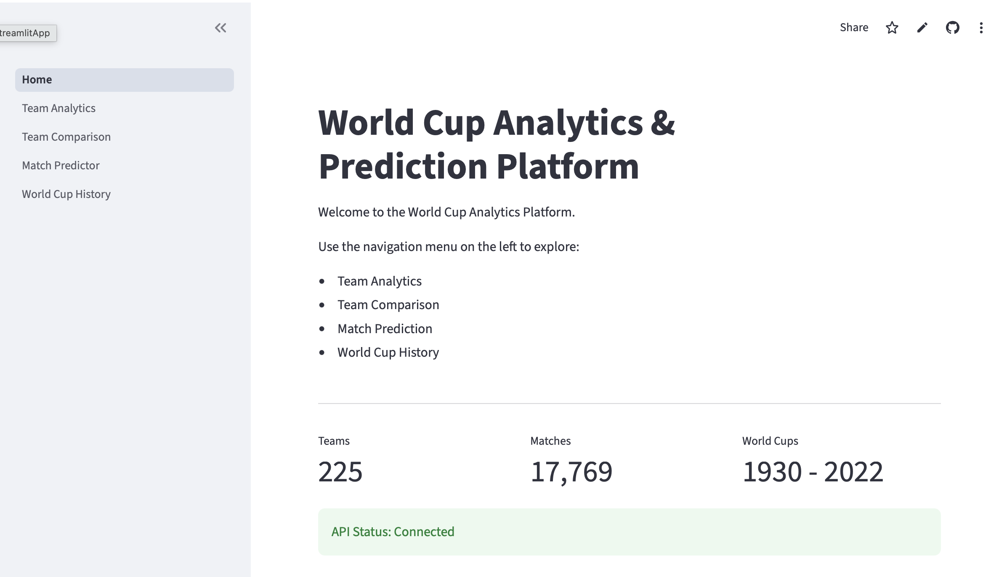
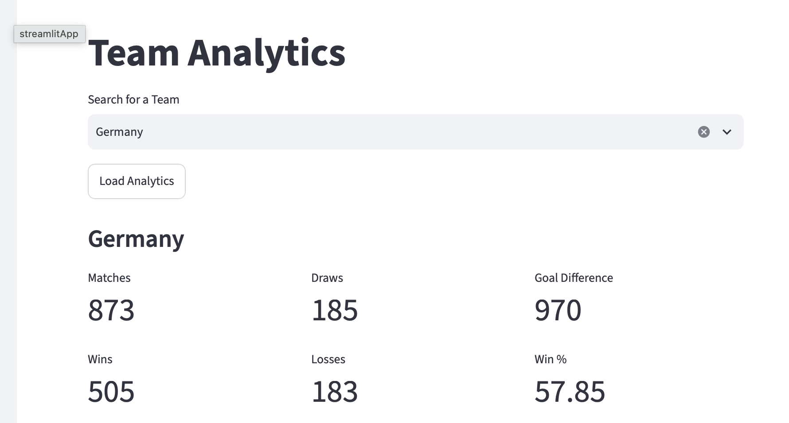
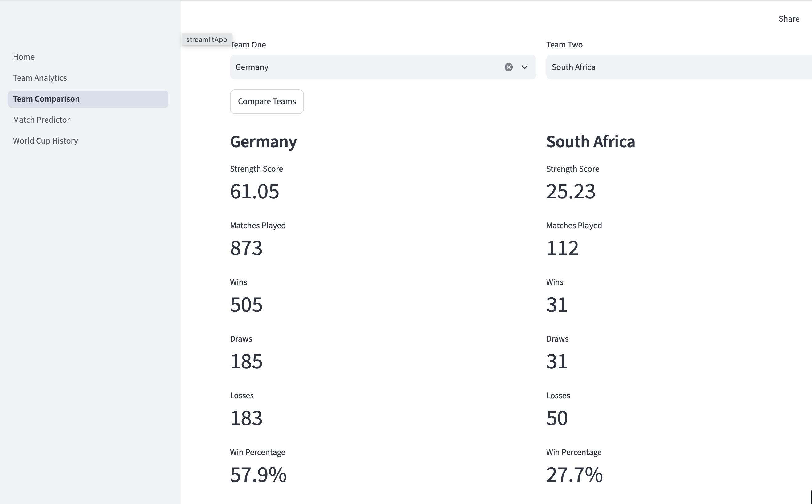
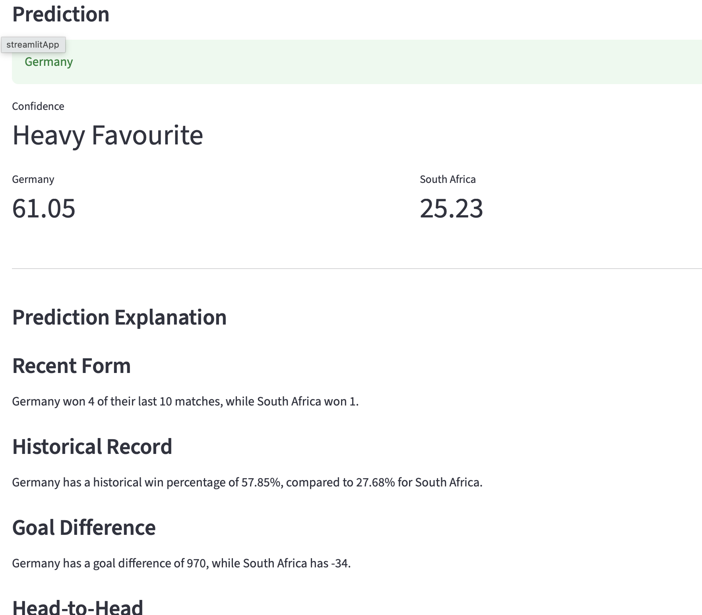
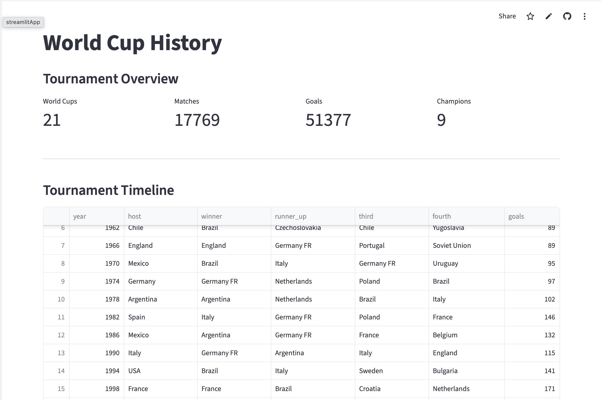
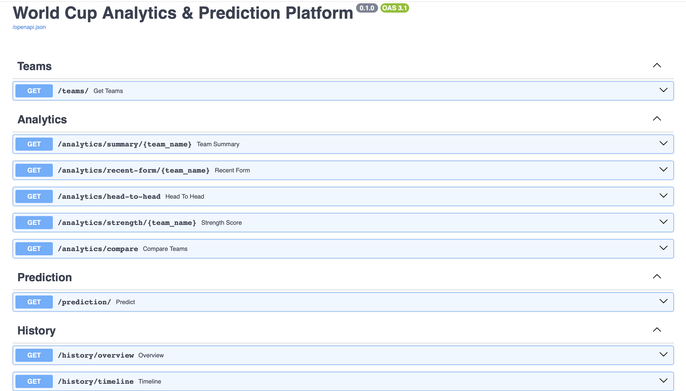

#  World Cup Analytics & Prediction Platform

A full-stack analytics platform built to explore FIFA World Cup history, compare national teams, and generate rule-based match predictions using historical football data.

The project demonstrates backend software engineering, database design, REST API development, cloud deployment, containerization, and interactive data visualization.

---

# Live Demo Links

### Dashboard
https://lesedilebotsa-world-cup-analytics-platfo-dashboard1-home-c2v1je.streamlit.app

### REST API

https://world-cup-analytics-platform-1.onrender.com

### API Documentation (Swagger)

https://world-cup-analytics-platform-1.onrender.com/docs


# Screenshots

- 
- 
- 
- 
- 
- 

---

# Features

## Team Analytics

- Team summary statistics
- Wins, draws and losses
- Goals scored and conceded
- Goal difference
- Win percentage
- Recent form analysis
- Team strength score

---

## Team Comparison

Compare two national teams using

- Head-to-head record
- Win percentages
- Goals scored
- Goal difference
- Historical performance

---

## Match Prediction Engine

Rule-based prediction system using

- Historical win percentage
- Goal difference
- Recent form
- Team strength score
- Head-to-head performance

Returns

- Predicted winner
- Confidence score
- Explanation of prediction

---

## World Cup History

Historical analytics including

- Tournament timeline
- Champions
- World Cup facts
- Tournament statistics
- Total goals
- Total matches
- Most successful nation

---

## REST API

Built with FastAPI

Includes

- Team endpoints
- Analytics endpoints
- Prediction endpoints
- World Cup history endpoints
- Interactive Swagger documentation

---

# Technology Stack

## Backend

- Python
- FastAPI
- SQLAlchemy
- PostgreSQL
- Pandas

## Frontend

- Streamlit
- Plotly

## DevOps

- Docker
- Docker Compose
- Render
- Streamlit Community Cloud

## Performance & Security

- Redis caching
- API rate limiting
- Request logging
- Health check endpoint

## Testing

- Pytest

## Version Control

- Git
- GitHub

---

# Software Architecture

The project follows a layered architecture.

```
Dashboard (Streamlit)
          │
          ▼
REST API (FastAPI)
          │
          ▼
Service Layer
          │
          ▼
Repository Layer
          │
          ▼
PostgreSQL Database
```

---

# Project Structure

```
World-Cup-Analytics-Platform
│
├── app/
│   ├── routers/
│   ├── exceptions.py
│   └── main.py
│
├── services/
│   ├── prediction/
│   ├── analytics/
│   ├── repositories/
│   ├── importers/
│   └── history/
│
├── dashboard/
│   ├── pages/
│   ├── components/
│   ├── client.py
│   └── config.py
│
├── api_services/
│   ├── middleware/
│   ├── security/
│   └── cache/
│
├── data/
│
├── docs/
│
├── scripts/
│
├── tests/
│
├── Dockerfile
├── docker-compose.yml
└── requirements.txt
```

---

# Database

PostgreSQL stores

- Teams
- Historical international matches
- FIFA World Cup tournaments

The database is automatically initialized using setup scripts.

---

# API Endpoints

## Teams

```
GET /teams
```

---

## Analytics

```
GET /analytics/summary/{team}

GET /analytics/recent-form/{team}

GET /analytics/head-to-head

GET /analytics/strength/{team}

GET /analytics/compare
```

---

## Prediction

```
GET /prediction
```

---

## World Cup History

```
GET /history/overview

GET /history/timeline

GET /history/winners

GET /history/facts

GET /history/tournament/{year}
```

---

# Deployment

## Backend

- Render

## Dashboard

- Streamlit Community Cloud

## Containerization

- Docker
- Docker Compose

---

# Engineering Features

- Layered architecture
- Repository pattern
- Service layer
- RESTful API
- Request logging middleware
- API timing middleware
- Rate limiting
- Redis caching
- Docker containerization
- Cloud deployment
- Health monitoring
- Environment variable configuration
- Database initialization scripts

---

# Challenges Solved

During development the following engineering challenges were addressed

- PostgreSQL connection configuration
- SQLAlchemy database connectivity
- Redis integration
- FastAPI rate limiting
- Docker deployment
- Render deployment
- Streamlit deployment
- Production logging
- Database initialization
- Import path resolution
- Cloud environment configuration

See

```
docs/challenges/docker challenges.md
docs/challenges
```

for detailed documentation.

---

# Future Improvements (Version 2.0)

- Machine Learning prediction model
- Team ranking model
- Expected Goals (xG)
- Tournament simulation
- Player statistics
- Authentication
- User favourites
- Prediction history
- Scheduled ETL pipeline
- CI/CD with GitHub Actions
- Kubernetes deployment
- AWS deployment
- Monitoring and observability
- Prometheus & Grafana
- ML model evaluation dashboard

---

# Learning Outcomes

This project demonstrates practical experience with

- Backend Software Engineering
- REST API Development
- PostgreSQL
- SQLAlchemy ORM
- Data Engineering
- Docker
- Cloud Deployment
- Software Architecture
- Repository Pattern
- Service Layer Pattern
- Python
- Streamlit
- FastAPI
- Redis
- Rate Limiting
- Logging
- Git
- GitHub

---

# Running Locally

Clone the repository

```bash
git clone https://github.com/LesediLebotsa/World-Cup-Analytics-Platform.git

cd World-Cup-Analytics-Platform
```

Install dependencies

```bash
pip install -r requirements.txt
```

Configure environment variables

```env
DATABASE_URL=...
API_URL=http://127.0.0.1:8000
REDIS_HOST=localhost
```

Start PostgreSQL and Redis.

Initialize the database

```bash
python -m scripts.setup_database
```

Run the API

```bash
uvicorn app.main:app --reload
```

Run the dashboard

```bash
streamlit run dashboard/1_Home.py
```

---

# Author

**Lesedi Lebotsa**

BSc Information Technology (Software Engineering) Year 2/3

* Backend Software Engineering 
* DevOps engineering
* Cloud Engineering 

GitHub

https://github.com/LesediLebotsa

---
